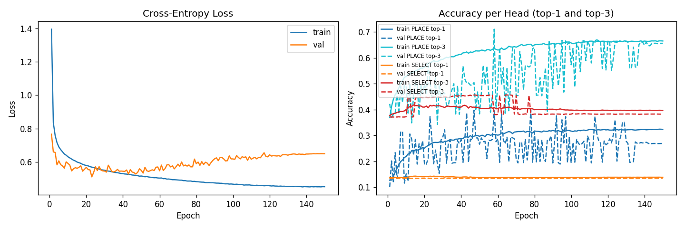

# Training Summary — A1_baseline_cnn

**Date**: 2026-05-09 22:35

## Config
| Key | Value |
|-----|-------|
| data | `projects\supervised-cloning\data\collected_5k.npz` |
| epochs | 150 |
| batch | 256 |
| lr | 0.001 |
| λ (select weight) | 1.0 |
| val_split | 0.15 |
| seed | 42 |
| device | cpu |

## Dataset
| | Samples |
|--|--|
| train (after aug) | 331,576 |
| val (no aug) | 7,362 |

## Results
| Metric | Train | Val |
|--------|-------|-----|
| Best epoch | — | 78 |
| Best val acc (avg heads) | — | 26.70% |
| Final loss | 0.4524 | 0.6498 |
| PLACE top-1 (final) | 32.36% | 26.92% |
| PLACE top-3 (final) | 66.48% | 65.60% |
| SELECT top-1 (final) | 13.89% | 13.52% |
| SELECT top-3 (final) | 39.71% | 38.25% |

## Notes
