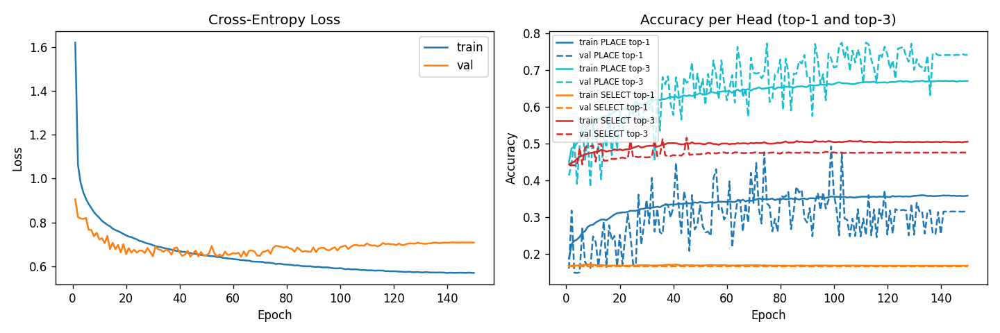

# Training Summary — B1_dagger_diverse

**Date**: 2026-05-13 18:21

## Config
| Key | Value |
|-----|-------|
| data | `projects\supervised-cloning\data\B1_diverse.npz`, `projects\supervised-cloning\data\B1_dagger.npz` |
| epochs | 150 |
| batch | 256 |
| lr | 0.001 |
| λ (select weight) | 1.0 |
| val_split | 0.15 |
| seed | 42 |
| device | cpu |

## Dataset
| | Samples |
|--|--|
| train (after aug) | 421,176 |
| val (no aug) | 9,305 |

## Results
| Metric | Train | Val |
|--------|-------|-----|
| Best epoch | — | 99 |
| Best val acc (avg heads) | — | 32.86% |
| Final loss | 0.5694 | 0.7080 |
| PLACE top-1 (final) | 35.78% | 31.46% |
| PLACE top-3 (final) | 66.94% | 74.04% |
| SELECT top-1 (final) | 16.75% | 16.58% |
| SELECT top-3 (final) | 50.43% | 47.50% |

## Win-rate evaluation (best checkpoint, 50 matches each)
| Baseline | Win rate |
|----------|----------|
| random | 60.00% |
| minimax_d2 | 0.00% |

## Notes
