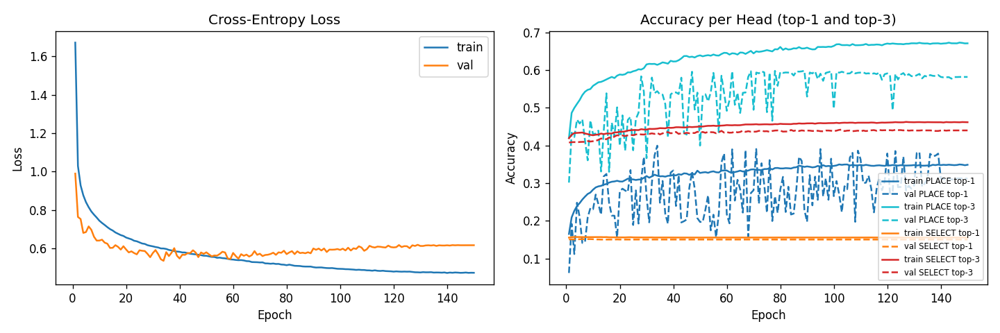

# Training Summary — B1_dagger_diverse_bc

**Date**: 2026-05-13 15:25

## Config
| Key | Value |
|-----|-------|
| data | `projects\supervised-cloning\data\B1_diverse.npz` |
| epochs | 150 |
| batch | 256 |
| lr | 0.001 |
| λ (select weight) | 1.0 |
| val_split | 0.15 |
| seed | 42 |
| device | cpu |

## Dataset
| | Samples |
|--|--|
| train (after aug) | 322,440 |
| val (no aug) | 7,166 |

## Results
| Metric | Train | Val |
|--------|-------|-----|
| Best epoch | — | 34 |
| Best val acc (avg heads) | — | 27.52% |
| Final loss | 0.4735 | 0.6169 |
| PLACE top-1 (final) | 34.90% | 31.26% |
| PLACE top-3 (final) | 67.12% | 58.20% |
| SELECT top-1 (final) | 15.61% | 15.07% |
| SELECT top-3 (final) | 46.19% | 44.01% |

## Notes

> **2026-05-13 — augmentation bug retroactively identified.** The
> `_pos_inv` table in `train.py` composed flip and CW-rotation in the
> wrong order for transforms t ∈ {4,5,6,7}, mislabeling PLACE targets,
> PLACE legal masks, and SELECT soft targets (none in this run, since
> soft targets did not yet exist) in 4 of every 8 augmented copies of
> every PLACE sample. SELECT samples are unaffected. This run is the
> *interim* clone in the B1 DAgger flow; PLACE numbers above are
> conservative vs. what a re-run with the fixed augmentation would
> reach on the same data. Fix details: project README →
> `Operational notes`.
