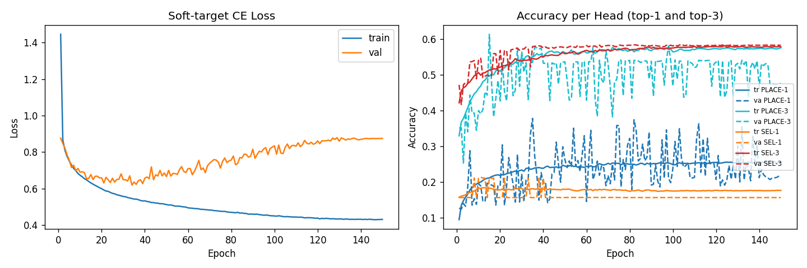

# Training Summary — C1_unifiedAux_hard

**Date**: 2026-05-14 14:37

## Config
| Key | Value |
|-----|-------|
| model | QuartoCNNAutoregUnified |
| data | `projects\supervised-cloning\data\C1_unified.npz` |
| epochs | 150 |
| batch | 256 |
| lr | 0.001 |
| λ (select weight) | 1.0 |
| soft_weight | 0.0 |
| val_split | 0.15 |
| seed | 42 |
| device | cpu |

## Dataset
| | Samples |
|--|--|
| train (after aug) | 329,312 |
| val (no aug) | 7,274 |

## Results
| Metric | Train | Val |
|--------|-------|-----|
| Best epoch | — | 35 |
| Best val acc (avg heads) | — | 26.72% |
| Final loss | 0.4314 | 0.8745 |
| PLACE top-1 (final) | 25.45% | 21.59% |
| PLACE top-3 (final) | 57.55% | 47.54% |
| SELECT top-1 (final) | 17.65% | 15.64% |
| SELECT top-3 (final) | 57.85% | 58.29% |

## Win-rate evaluation (best checkpoint, 50 matches each)
| Baseline | Win rate |
|----------|----------|
| random | 76.00% |
| minimax_d2 | 0.00% |

## Notes
